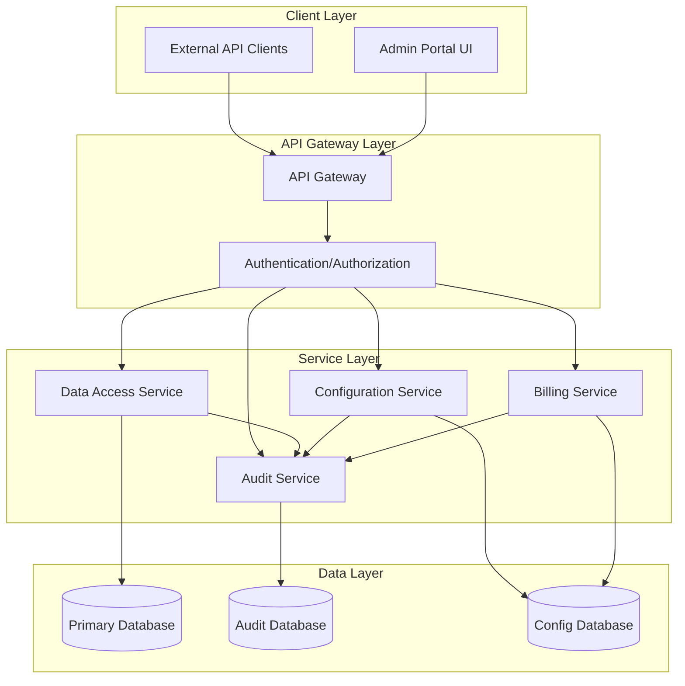

# A comprehensive serverless microservice architecture with an admin portal. Let me break this down and create a detailed solution.




Let me create a basic implementation of the core service handlers:


```typescript
// Types
interface DatabaseConfig {
  type: 'mysql' | 'postgres' | 'mongodb';
  connection: {
    host: string;
    port: number;
    database: string;
    username: string;
    password: string;
  };
  permissions: {
    read: boolean;
    write: boolean;
    audit: boolean;
  };
}

interface AuditLog {
  timestamp: Date;
  action: string;
  userId: string;
  resourceId: string;
  details: any;
}

interface BillingConfig {
  apiKey: string;
  rateLimit: number;
  pricingTier: string;
  quotaLimit: number;
}

// Service Handlers
class DataAccessService {
  private connections: Map<string, any> = new Map();

  async connect(config: DatabaseConfig): Promise<void> {
    // Implementation for database connection based on config
    const connection = await this.createConnection(config);
    this.connections.set(config.connection.database, connection);
  }

  async query(database: string, query: string): Promise<any> {
    const connection = this.connections.get(database);
    if (!connection) {
      throw new Error('Database connection not found');
    }
    
    // Execute query and return results
    return await connection.execute(query);
  }

  private async createConnection(config: DatabaseConfig): Promise<any> {
    // Implementation for creating specific database connections
    switch (config.type) {
      case 'mysql':
        // Return MySQL connection
        break;
      case 'postgres':
        // Return PostgreSQL connection
        break;
      case 'mongodb':
        // Return MongoDB connection
        break;
    }
  }
}

class AuditService {
  private auditDb: any;

  async logAction(log: AuditLog): Promise<void> {
    await this.auditDb.collection('audit_logs').insertOne({
      ...log,
      timestamp: new Date()
    });
  }

  async getAuditLogs(filters: any): Promise<AuditLog[]> {
    return await this.auditDb.collection('audit_logs')
      .find(filters)
      .sort({ timestamp: -1 })
      .toArray();
  }
}

class BillingService {
  private configDb: any;

  async validateApiKey(apiKey: string): Promise<BillingConfig> {
    const config = await this.configDb.collection('billing_config')
      .findOne({ apiKey });
    
    if (!config) {
      throw new Error('Invalid API key');
    }
    
    return config;
  }

  async updateUsage(apiKey: string, usage: number): Promise<void> {
    await this.configDb.collection('usage_metrics').updateOne(
      { apiKey },
      { 
        $inc: { currentUsage: usage },
        $set: { lastUpdated: new Date() }
      },
      { upsert: true }
    );
  }
}

class ConfigurationService {
  private configDb: any;

  async saveConfig(databaseId: string, config: DatabaseConfig): Promise<void> {
    await this.configDb.collection('database_configs').updateOne(
      { databaseId },
      { $set: config },
      { upsert: true }
    );
  }

  async getConfig(databaseId: string): Promise<DatabaseConfig> {
    return await this.configDb.collection('database_configs')
      .findOne({ databaseId });
  }
}

```

Here's how the system works:

1. Architecture Overview:
   - API Gateway handles all incoming requests and authentication
   - Separate microservices for data access, auditing, billing, and configuration
   - Each service has its own database for isolation and scalability
   - Admin portal interfaces with all services through the API gateway

2. Key Components:
   - Data Access Service: Manages database connections and query execution
   - Audit Service: Logs all system actions and provides audit trail
   - Billing Service: Handles API key validation and usage tracking
   - Configuration Service: Manages database connections and permissions

3. Security Features:
   - Authentication at the API Gateway level
   - Fine-grained permissions for database access
   - Comprehensive audit logging
   - API key-based access control

4. Monetization Features:
   - API key management
   - Usage tracking and quotas
   - Different pricing tiers
   - Rate limiting capabilities

To implement this system, you would need to:

1. Set up cloud infrastructure (e.g., AWS Lambda, Azure Functions)
2. Create the databases (suggest MongoDB for flexibility)
3. Implement the admin portal frontend (React/Next.js recommended)
4. Deploy the API Gateway with proper security configurations
5. Set up monitoring and alerting

Would you like me to focus on any particular aspect of this architecture? I can provide more detailed implementation guidance for specific components or create example API endpoints for the admin portal.
